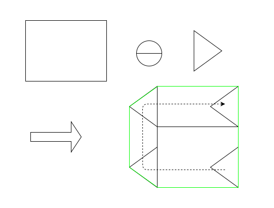

R3年度課題研究 研究レポート

# Processingを用いた物理シミュレーション

<p align=right>
T高校 H1rono_K
</p>

## 要旨

Processingを用いた物理シミュレーションのプログラムを作成、検証した。

## はじめに

高校物理で現実世界の現象をどれだけ再現できるのか。この疑問を検証するために、Processingを用いて物理シミュレーションを行った。Processingとは、アニメーション作成に特化したプログラミング言語及び環境で、誰でも手軽に使えることが利点である。

- Processingのウェブサイト: https://processing.org/

この研究では、物理シミュレーションの中でも特に剛体シミュレーションと呼ばれるものを対象とした。ここでは、物理シミュレーションのプログラムの概略と共に具体的な実装内容を紹介していく。ProcessingはJavaをベースとしており、紹介するプログラムでもJavaの機能を随所で使用していることに留意して欲しい。紹介するプログラムはあくまで概略であるが、実際のプログラムは https://github.com/h1rono/physical-simulation/tree/main/main を参照してほしい。

## 実装

### 要件

高校の知識で3次元の剛体シミュレーションを行うことは難しいと判断したため、この研究では2次元での剛体シミュレーションを作成した。また、実際に使われている物流シミュレーションでは剛体の回転を計算しているが、慣性テンソルといった高校では習わない知識を要求されるため、並進運動のみに限定して計算を行った。

### シミュレーションの流れ

シミュレーションでは、$\frac{1}{60}$秒といった微小時間での剛体の変化を計算し、それを画像(フレーム)に反映させるということを繰り返し行う。一回の計算は次のプロセスに分解される。

1. 剛体に重力を加える
2. 剛体同士の衝突を検出する
3. 衝突によって起こる力(拘束力と呼ばれる)を計算する
4. 剛体の位置を更新する

プログラムでは、これらのプロセスをまとめて行うクラス`World`を作成した。具体的には以下のようになる。

```java
class World {
    // 剛体に重力を加える
    // delta_timeは微小時間
    private void apply_external_force(float delta_time) {}
    // 剛体同士の衝突を検出する
    private void detect_collision() {}
    // 拘束力を計算する
    private void solve_constraints(float delta_time) {}
    // 剛体の位置を更新する
    private void move(float delta_time) {}

    public void update(float delta_time) {
        apply_external_force(delta_time);
        detect_collision();
        solve_constraints(delta_time);
        move(delta_time);
    }
}
```

以降はそれぞれのプロセスの具体的な内容を解説する。

### 剛体に重力を加える

重力を加えて剛体の速度を変化させる。微小時間$\Delta t$において、重力加速度$g$による速度の変化量は$\Delta v = g \Delta t$である。ここでは剛体の位置は変更しない。プログラムは以下の通り。

```java
import java.util.List;

class World{
    // 重力加速度を表現する変数
    private PVector gravity;
    // 剛体のリスト
    // Rigidは剛体を表現するクラス
    private List<Rigid> rigids;

    private void apply_external_force(float delta_time) {
        // 重力による速度の変化量
        PVector delta_velocity = PVector.mult(gravity, delta_time);
        // 剛体にdelta_velocityを追加していく
        for (Rigid rigid : rigids) {
            // add_velocityで剛体の速度を変更する
            rigid.add_velocity(delta_velocity);
        }
    }
}
```

`PVector`はProcessingでベクトルを表現する型である。使い方については https://yoppa.org/geidai_media1_17/8203.html などが参考になる。`Rigid`は剛体を表現する自作の型である。その詳細は後ほど紹介する。

### 剛体同士の衝突を検出する

単純化のため、剛体の形状は楕円や凸多角形など、凸性のものだけに限定する。厳密には、扱う図形は「周及び内部の任意の2点を結ぶ線分がその図形からはみ出ない」という条件を満たすもののみに限定する。以降、この性質を満たす図形を「凸包」と呼ぶ。

また、このプロセスで得た衝突の情報を次の「拘束力の計算」で使用するため、衝突情報を表現する型`Pair`を作成する。

```java
// 衝突の状態を表現する列挙型
enum PairType {
    // 衝突していない、新たな衝突、前のフレームから継続した衝突
    not_collide, collide_new, collide_keep;
}

class Pair {
    // 衝突している剛体2つ
    public Rigid rigid_a, rigid_b;
    // 衝突の状態
    public PairType type;
    // 衝突を解消するのに最適なベクトル。詳しくは後述
    public PVector contact_normal;
}
```

衝突判定は以下の2段階からなる。

1. ブロードフェーズ(Broad Phase)
2. ナローフェーズ(Narrow Phase)

ブロードフェーズでは大まかな衝突判定を行う。様々な方式があるが、この研究では軸並行バウンディングボックス(Axis-Aligned Bounding Box, AABB)を用いる方法を採用した。AABBとは、各軸の最小値、最大値を頂点に持つ四角形である。以下の画像のように、AABBは凸包に密着するような長方形となる。



それぞれの剛体についてAABBが交差しているか判定し、交差している場合はナローフェーズでより詳細な衝突判定を行う。

ナローフェーズでは、GJK(Gilbert-Johnson-Keerthi)法というアルゴリズムで衝突を判定し、EPA(Expanding Polytope Algorithm)法というアルゴリズムで衝突を解消するベクトルを求める。衝突を解消するベクトルは、次の「拘束力を計算する」プロセスで使用する。このベクトルの方向が、衝突している2剛体間で働く力の方向となる。

GJK法は、サポート写像(support function)とミンコフスキー差(Minkowski Difference)の2つを利用して凸包が衝突しているかどうかを判定するアルゴリズムである。アルゴリズムの具体的な中身を解説する前に、まずはサポート写像とミンコフスキー差について説明する。前提条件として、図形は「図形上の点への位置ベクトルの集合」として扱う。

まずはサポート写像について説明する。サポート写像は凸包を表現する関数の一種である。図形$P$のサポート写像$f_P(\vec{v})$の定義は、「$P$に含まれるベクトルの中で、$\vec{v}$との内積が最大のもの」である。説明は省略するが、サポート写像で得られるベクトルは全て凸包の周上のものである。例えば、円のサポート写像は次のようになる。


次に、ミンコフスキー差について説明する。図形$A$と図形$B$のミンコフスキー差は次のように定義される。

$$A \ominus B = \{ \vec{a} - \vec{b} \mid \vec{a} \in A, \vec{b} \in B \}$$

例えば、長方形と三角形のミンコフスキー差は次のように、反転させた三角形を長方形に沿って移動させてできる図形となる。



ここで、2つの図形が衝突しているとき、$\vec{a} = \vec{b}$となる$\vec{a} \in A, \vec{b} \in B$が存在するため、ミンコフスキー差は原点を含むことになる。

また、ミンコフスキー差のサポート写像$f_{A \ominus B}(\vec{v})$は「$\vec{a} \in A, \vec{b} \in B$に対して$\vec{a} \cdot \vec{v} - \vec{b} \cdot \vec{v}$を最大にするベクトル$\vec{a} - \vec{b}$」である。「$\vec{a} \cdot \vec{v} - \vec{b} \cdot \vec{v}$が最大」$\Longleftrightarrow$「$\vec{a} \cdot \vec{v}$が最大、かつ$-\vec{b} \cdot \vec{v}$が最大」$\Longleftrightarrow$「$\vec{a} = f_A(\vec{v})$かつ$\vec{b} = f_B(\vec{-v})$」となるため、$f_{A \ominus B}(\vec{v}) = f_A(\vec{v}) - f_B(\vec{-v})$が成り立つ。

プログラムでは凸包を表現する型`Convex`と、サポート写像のみで表現したミンコフスキー差のクラス`MinkowskiDiff`を以下のように実装した。

```java
interface Convex {
    // サポート写像
    public PVector support(PVector point);
}

class MinkowskiDiff implements Convex {
    // convex_a - convex_b
    private Convex convex_a, convex_b;

    public MinkowskiDiff(Convex convex_a, Convex convex_b) {
        this.convex_a = convex_a;
        this.convex_b = convex_b;
    }

    public PVector support(PVector point) {
        PVector sup_a = convex_a.support(point);
        PVector sup_b = convex_b.support(PVector.mult(point, -1));
        return sup_a.sub(sup_b);
    }
}
```

GJK法はこれらのことを利用して、サポート写像を用いて「ミンコフスキー差が原点を含んでいるかどうか」を判定することによって「凸2つが衝突しているかどうか」を判定するアルゴリズムである。その後、EPA法はミンコフスキー差の周上の点を多角形の頂点に追加していくことで衝突解消ベクトルを求める。2つの凸包のミンコフスキー差を$P$とすると、GJK法及びEPA法の内容は次のようになる。

1. $P$の周上の点を適当に選び$\vec{p_0}$とする。
2. $\vec{p_0} = \vec{0}$である場合は衝突しているとして終了。$P$の周上に$\vec{0}$があることになるため、衝突解消ベクトルは$\vec{0}$である。
3. $\vec{p_1} = f_P(-\vec{p_0})$とする。$\vec{p_1}$は$\vec{p_0}$のいわゆる「対蹠点」である。
4. 2と同様に、$\vec{p_1} = \vec{0}$の場合は衝突しているとして終了。衝突解消ベクトルは$\vec{0}$である。
5. $\vec{p_0} \cdot \vec{p_1} > 0$の場合は$P$が象限を跨いでいないため、衝突していないとして終了。
6. $\vec{p_0}, \vec{p_1}$を結ぶ直線と垂直な方向のベクトルを求め、$\vec{v}$とする。このベクトルは2つあるが、$\vec{p_0}$との内積が負のもの(直線から原点を向いているもの)を選ぶ。
7. $\vec{p_2} = \vec{v}$とする。2と同様、$\vec{p_2} = \vec{0}$の場合は衝突しているとして終了。
8. 3つのベクトル$\vec{p_0}, \vec{p_1}, \vec{p_2}$を頂点とする三角形を$T$とする。
9. $T$が原点を含む場合、衝突しているとしてGJKを終了。11に移る。
10. $T$が原点を含んでいない場合、3つのベクトル$\vec{p_0}, \vec{p_1}, \vec{p_2}$のうち大きさが小さいもの2つを選んで$\vec{p_0}, \vec{p_1}$とし、6に戻る。
11. 以降はEPA法である。$Q$を3点$\vec{p_0}, \vec{p_1}, \vec{p_2}$を含む多角形とし、この多角形に頂点を追加していく。
12. 原点から$Q$まで最短のベクトルを$\vec{v}$とする。$\vec{v}$が変化しなくなったらそれが衝突解消ベクトルである。
13. $\vec{p} = f_P(\vec{v})$とし、$\vec{p}$を$Q$に追加する。
14. 12に戻る。

アルゴリズムの中身を実装したプログラムは長くなるため割愛する。衝突判定全体のプログラムは次のようになる。

```java
// AABBが衝突しているかどうかを判定する
boolean aabb_collide(Convex convex_a, Convex convex_b) {}

// GJK法、EPA法を使って衝突情報を作成する
Pair make_pair(Rigid rigid_a, Rigid rigid_b) {}

class World {
    // 衝突情報のリスト
    private List<Pair> pairs;

    // pairがpairs内にあるかどうかを判定する
    private boolean contain_pair(Pair pair) {}

    private void detect_collision() {
        int rigid_num = rigids.size();
        // 前フレームのpairsと比較するためのリスト
        List<Pair> new_pairs = new ArrayList<Pair>();
        // 剛体2つの組み合わせ全てで衝突を検査
        for (int i = 0; i < rigid_num - 1; i++)
        for (int j = i + 1; j < rigid_num; j++) {
            Rigid rigid_i = rigids.get(i), rigid_j = rigids.get(j);
            // ナローフェーズ
            if (!aabb_collide(rigid_i, rigid_j)) {
                continue;
            }
            Pair pair = make_pair(rigid_i, rigid_j);
            if (pair.type == PairType.not_collide) {
                // 衝突していないため、new_pairsには追加しない
                continue;
            }
            if (contain_pair(pair)) {
                pair.type = PairType.collide_keep;
            }
            new_pairs.add(pair);
        }
        pairs.clear();
        pairs = new_pairs;
    }
}
```

### 拘束力を計算する

2剛体$A, B$の衝突を考える。以降は衝突解消ベクトルの向きにおける変化について議論する。衝突前の2剛体の速度を$v_A, v_B$、衝突後の2剛体の速度を$v_A', v_B'$とし、この2剛体の反発係数を$e$とする。このとき、

$$e = -\frac{v_A' - v_B'}{v_A - v_B}$$

が成り立つ。このように、2剛体は衝突によって運動の方向が「拘束」されるため、このプロセスは「拘束力の計算」と呼ばれる。2剛体の質量を$m_A, m_B$とし、2剛体間に働く撃力(力積)を$I$とすると、

$$m_Av_A' = m_Av_A + I \Longleftrightarrow v_A' = v_A + \frac{I}{m_A}$$
$$m_Bv_B' = m_Bv_B - I \Longleftrightarrow v_B' = v_B - \frac{I}{m_B}$$

が得られる。今、未知の変数は$v_A', v_B', I$の2つであり、$I$が決定されると$v_A', v_B'$も決定されるため、上記の3式から$v_A', v_B'$を消去して$I$について解く。解いた結果は次のようになる。

$$I = - \frac{m_Am_B}{m_A + m_B} (1 + e) (v_A - v_B)$$

このように、衝突のペア1つずつから撃力の式が得られる。複数の剛体が一度に衝突した場合は、撃力が複数発生することになる。複数の拘束条件を満たすようにする一般的な解法は次の通りである。

1. すべての拘束条件を順番に1つずつ解く。
2. すべての拘束条件に対して速度のずれを計算する。ここである拘束条件が満たされている場合はそのずれが$0$になる。
3. ずれの大きさの和を取り、この値が大きい場合は1に戻って処理を繰り返す。

この操作をプログラムにするとかなり複雑になるため、具体的な内容は割愛する。

### 剛体の位置を更新する

`World`クラスの`move`関数は以下のようになっている。

```java
class World {
    public void move(float delta_time) {
        for (Rigid rigid : rigids) {
            rigid.move(delta_time);
        }
    }
}
```

ここからも分かるように、各剛体オブジェクトに`move`メソッドを持たせることで位置の更新は各剛体に委譲した。例として、球を表現する`Ball`は以下のように定義されている。

```java
class Ball extends Rigid {
    private PVector center, velocity;

    public void move(float delta_time) {
        center.add(PVector.mult(velocity, delta_time));
    }
}
```

### Rigidの実装

剛体を表現する型`Rigid`の概略は以下の通りである。

```java
abstract class Rigid implements Convex {
    // 速度を取得する
    public abstract PVector get_velocity();
    // 速度を変更する
    public abstract void add_velocity(PVector delta_velocity);
    // 位置を動かす
    public abstract void move(float delta_time);
    // 質量を取得する
    public abstract float get_mass();
}
```

## プログラムを実行した結果

プログラムの実行方法は以下の通りである。なお、前提条件としてProcessingがパソコンにインストールされている必要がある。

1. https://github.com/h1rono/physical-simulation/tree/main を開く
2. 緑色の「code」ボタンを押す
3. 「Download Zip」を押して、ダウンロードされた`.zip`ファイルを解凍する
4. 解凍したフォルダー内にある`main`というフォルダーを開く
5. そこにある`main.pde`ファイルをProcessing IDEで開く
6. IDE左上の実行ボタンを押して実行する

今回作ったプログラムではボールのバウンドをシミュレーションしているが、現実世界の動きとは程遠い結果に終わってしまった。原因としては「拘束力を計算する」プロセスで計算ミスがあると思われるため、今後はそのバグを修正していきたい。

## 考察

実際にプログラムを書いてみて分かったのは、現実世界の問題を解くためには高校以上の知識をより深く理解することが要求されることである。また、こういった物流シミュレーションをゲームに適用する機会も増えており、そういった場合にはより精度が高く、より高速な計算が要求されると考えられる。そういった需要に答えることができるように、大学での勉強を頑張りたい。

## 謝辞

この研究を進めるにあたって助言を下さった笠場先輩に感謝します。

## 参考文献

プログラムを書くにあたって参考にしたサイトは以下の通りである。

- https://qiita.com/edo_m18/items/f7698c5bd262df4f9cf3
- https://qiita.com/edo_m18/items/6051d2d8e422a41d0c13
- http://slis.tsukuba.ac.jp/~fujisawa.makoto.fu/lecture/iml/index.html
- https://trap.jp/post/198/

また、以下の本を参考にした。

- ゲーム製作者のための物流シミュレーション 剛体編<br>https://book.impress.co.jp/books/3282
