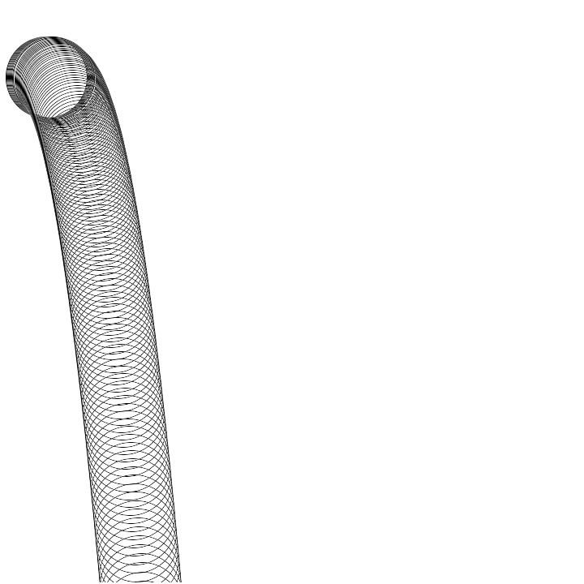

# Processingを用いた物理シミュレーション

## はじめに

高校物理で現実世界の現象をどれだけ再現できるのか。この疑問を検証するために、Processingを用いた物理シミュレーションを作成した。この研究では、剛体シミュレーションの中でも特に物体の並進運動にのみ注目したシミュレーションプログラムを作成した。

## 研究成果

実際に書いたプログラムは https://github.com/h1rono/physical-simulation/tree/main/main を参照してほしい。また、ここに掲載した画像は全てプログラムを実行した動画をffmpegを用いて1枚の画像に合成したものである。

ここでは主要なクラスのみ解説しておく。

クラス/インターフェース名 | 概要
:- | -:
`class World` | 「物理世界」を表現するクラス
`interface Rigid` | 「剛体」を表現するインターフェース
`class Ball` | 「球」を表現するクラス
`class Box` | 「長方形の箱」を表現するクラス

`Ball`クラスと`Box`クラスは`Rigid`を実装したクラスである。抽象的なシミュレーションを見据えて、`World`クラスの`add_element`メソッドで`Rigid`オブジェクトをシミュレーション対象として追加するという方針をとっている。シミュレーションの具体的な内容は`main.pde`内で設定する。

```java
// main.pde
// 0.05は1/60よりも少し大きいが十分に微小
final float delta_time = 0.05;
// 物理世界のオブジェクト
World world;

void setup() {
    // スクリーンサイズ
    size(720, 720);
    // World(重力加速度)
    world = new World(new PVector(0, 9.8));
    // シミュレーションする剛体を追加
    // ここでは球の斜方投射をシミュレーションする剛体設定
    // Ball(中心座標, 半径, 質量, 速度, 動くのかどうか)
    world.add_element(new Ball(
        new PVector(50, 100), // PVectorはベクトルの型
        50, 10, new PVector(10, -10), true));
}

void draw() {
    // スクリーンを白にクリア
    background(255);
    // 物理世界の時計を微小時間だけ進める
    world.update(delta_time);
    // 物理世界を描画
    world.draw(this);
}
```

追加する剛体を変更するだけでシミュレーションの内容を変えられるようになっている。このプログラムを実行すると、以下のような結果が得られる。



以降、シミュレーション例をいくつか紹介する。なお、載せてあるプログラムは`setup`関数内で剛体を追加する部分のみを切り取ってある。

### 球のバウンド

```java
// Box(中心座標, 横幅, 縦幅, 質量, 速度, 動くのかどうか)
// 床
world.add_element(new Box(new PVector(width / 2, height - 50), width, 100, 50, new PVector(0, 0), false));
world.add_element(new Ball(new PVector(-100, 100), 50, 10, new PVector(10, -10), true));
```

## まとめ

満足のいく結果とは言い難いが、物理学によって現実世界を解析できるということを自分の手で確かめることができた。以降は剛体の回転運動やばね、ひもなど、シミュレーションの領域を広げていくのに加えて、既存の実装をより効率的なものに改良するなど、更に開発を進めていきたい。最終的には、流体もシミュレーション可能なライブラリを作成したいと考えている。

## 参考文献

プログラムを書くにあたって参考にしたサイトは以下の通りである。

- https://qiita.com/edo_m18/items/f7698c5bd262df4f9cf3
- https://qiita.com/edo_m18/items/6051d2d8e422a41d0c13
- http://slis.tsukuba.ac.jp/~fujisawa.makoto.fu/lecture/iml/index.html
- https://trap.jp/post/198/

また、以下の本を参考にした。

- ゲーム製作者のための物理シミュレーション 剛体編<br>https://book.impress.co.jp/books/3282
